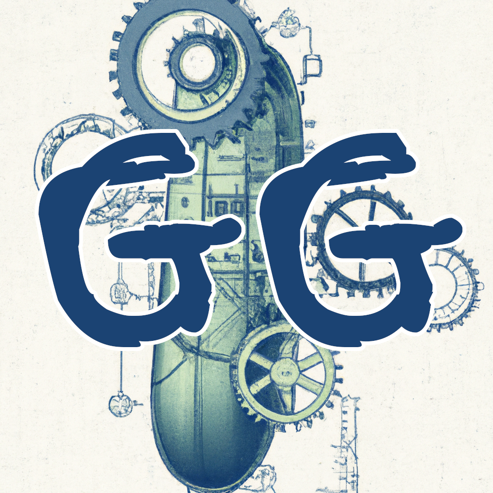

 

  

<h3 align="center">Gurkenwerfer_'s Gadgetry</h3>

  

    An assortment of various useful tools. Addon for 1.21 to be used with the latest dev build of <a href="https://github.com/MeteorDevelopment/meteor-client">Meteor Client</a>.
     
     
    <a href="https://github.com/stefexec/gurkens-gadgetry-public/issues">Report Bug</a>
    .
    <a href="https://github.com/stefexec/gurkens-gadgetry-public/pulls">Request Feature</a>
  

  

      <a href="https://img.shields.io/github/downloads/stefexec/gurkens-gadgetry-public/total" alt="Contributors">
      
      

    </a>

# Features
## Modules
- `Bedrock ESP` - Renders illegally placed bedrock blocks through walls.
- `BlastGuard` - Uses different methods to teleport away from explosions.
- `BoomESP` - Renders a box around about-to-explode things.
- `DubCounter` - Count the amount of double chests in render distance.
- `Gurkfly` - Fly like in creative mode. Only works on servers without anti-cheat.
- `NoChestRender` - Disables rendering of chests completely to improve performance.
- `NoCollision` - Removes Client-Side collision with blocks and the world border.
- `NoWorldBorder` - Disables the world border client side allowing you to walk through. DISABLE WHEN JOINING SINGLE PLAYER WORLDS!
- `Packet Logger` - A very basic packet logger.
- `WorldGuardBypass` - Easily move inside WorldGuard protected areas. Now with FlyKick Bypass!

## Commands
- `CamClip` - Clip to the y coordinate your freecam is pointing at.
- `AutoClip` - Tries to automatically clip to the next possible free space below you.

